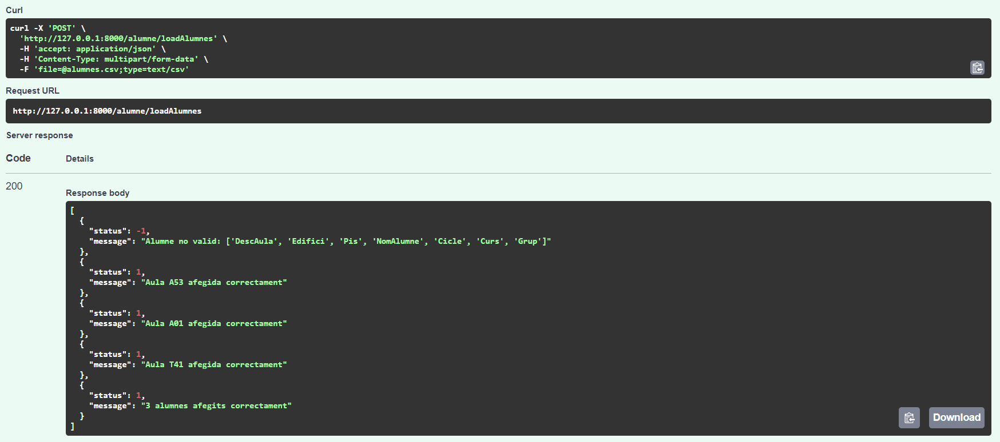
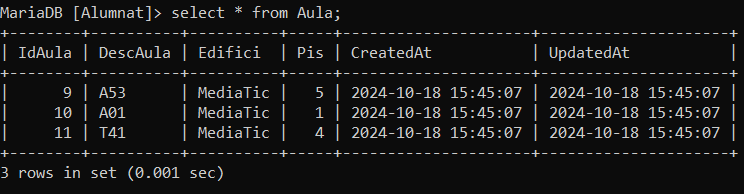
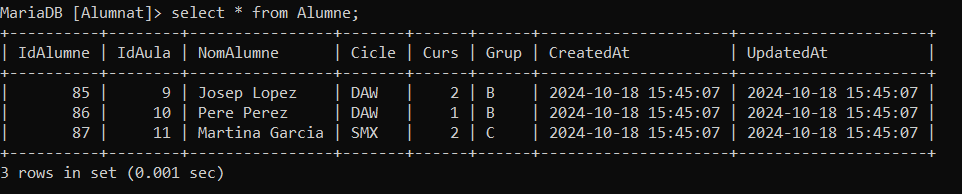

# Classe Alumnat

La classe `Alumnat` gestiona les operacions relacionades amb els alumnes en una base de dades, incloent la seva creació, obtenció, actualització i eliminació.

## Mètodes

### `formate_student(student)`

Converteix una llista amb la informació d'un alumne a un diccionari.

#### Paràmetres
- `student`: Llista que conté la informació d'un alumne.

#### Retorna
- Diccionari amb la informació formatada de l'alumne.

### `formate_new_student(student)`

Converteix una llista amb la informació d'un nou alumne a un diccionari.

#### Paràmetres
- `student`: Llista que conté la informació d'un nou alumne.

#### Retorna
- Diccionari amb la informació formatada del nou alumne.

### `formate_student_with_classrom_data(student)`

Converteix una llista amb la informació d'un alumne i la seva aula a un diccionari.

#### Paràmetres
- `student`: Llista que conté la informació d'un alumne amb dades de l'aula.

#### Retorna
- Diccionari amb la informació formatada de l'alumne i l'aula.

### `get_all_students(orderby: str = "ASC", contain: str | None = None, skip: int = 0, limit: int | None = None)`

Selecciona tots els alumnes de la base de dades i retorna una llista de diccionaris amb la informació dels alumnes.

#### Paràmetres
- `orderby`: Ordre de classificació (ASC o DESC).
- `contain`: Filtra els alumnes que contenen aquest valor en el nom.
- `skip`: Número d'alumnes a saltar.
- `limit`: Nombre màxim d'alumnes a retornar.

#### Retorna
- Llista de diccionaris amb la informació dels alumnes o un missatge d'error.

### `get_all_students_with_classrom_data()`

Selecciona tots els alumnes i fa un join amb la taula aula per després retornar una llista de diccionaris amb la informació.

#### Retorna
- Llista de diccionaris amb la informació dels alumnes i les aules o un missatge d'error.

### `get_student(id)`

Selecciona el primer alumne amb la id passada per paràmetre i passa el resultat de llista a diccionari.

#### Paràmetres
- `id`: Identificador de l'alumne.

#### Retorna
- Diccionari amb la informació de l'alumne o un missatge d'error si no existeix.

### `student_exist(id)`

Selecciona si un alumne existeix a la base de dades.

#### Paràmetres
- `id`: Identificador de l'alumne.

#### Retorna
- `True` si existeix, `False` si no existeix o un missatge d'error.

### `add_student(student)`

Comprova si l'aula existeix i afegeix l'alumne a la base de dades.

#### Paràmetres
- `student`: Diccionari o objecte que conté la informació de l'alumne a afegir.

#### Retorna
- Missatge d'èxit o error en afegir l'alumne.

### `add_many_students(student_list)`

Fa un insert amb una llista de alumnes.

#### Paràmetres
- `student_list`: Llista de diccionaris amb la informació dels alumnes.

#### Retorna
- Missatge amb el nombre d'alumnes afegits o un missatge d'error.

### `add_students_from_csv(file)`

Afegeix alumnes i aules des d'un fitxer CSV.

#### Paràmetres
- `file`: Fitxer CSV amb la informació dels alumnes.

#### Retorna
- Llista de respostes amb l'estat de cada inserció o un missatge d'error.

### `is_valid_row(row)`

Comproba si una fila del CSV conté valors vàlids.

#### Paràmetres
- `row`: Fila del fitxer CSV.

#### Retorna
- `True` si la fila és vàlida, `False` si no ho és.

### `update_student(id, student)`

Comprova si l'alumne i l'aula existeixen i modifica l'alumne.

#### Paràmetres
- `id`: Identificador de l'alumne a modificar.
- `student`: Objecte que conté la nova informació de l'alumne.

#### Retorna
- Missatge d'èxit o error en actualitzar l'alumne.

### `delete_student(id)`

Comprova si existeix l'alumne i l'elimina.

#### Paràmetres
- `id`: Identificador de l'alumne a eliminar.

#### Retorna
- Missatge d'èxit o error en eliminar l'alumne.

# Classe Aula

La classe `Aula` gestiona les operacions relacionades amb les aules en una base de dades, incloent la seva creació, verificació d'existència i obtenció de la seva ID.

## Mètodes

### `formate_classrom(classrom)`

Converteix una llista amb la informació d'una aula a un diccionari.

#### Paràmetres
- `classrom`: Llista que conté la informació d'una aula.

#### Retorna
- Diccionari amb la informació formatada de l'aula.

### `exist(id)`

Selecciona la primera aula amb la ID passada per paràmetre i retorna si existeix.

#### Paràmetres
- `id`: Identificador de l'aula.

#### Retorna
- `True` si existeix, `False` si no existeix o un missatge d'error.

### `get_id_by_desc(desc)`

Retorna la ID d'una aula segons la seva descripció.

#### Paràmetres
- `desc`: Descripció de l'aula.

#### Retorna
- ID de l'aula si existeix, `-1` si no existeix, o un missatge d'error.

### `add(classrom)`

Afegeix una aula a la base de dades.

#### Paràmetres
- `classrom`: Diccionari que conté la informació de l'aula a afegir.

#### Retorna
- Missatge d'èxit amb la ID de l'aula afegida o un missatge d'error.

# Classe CSV_controller

La classe `CSV_controller` gestiona la lectura de fitxers CSV, incloent la detecció i eliminació de contingut duplicat.

## Constructors

### `__init__(file)`

Crea una instància de la classe `CSV_controller`.

#### Paràmetres
- `file`: Fitxer CSV que es vol llegir.

## Mètodes

### `get_content()`

Llegeix el contingut del fitxer CSV, elimina el contingut duplicat i el retorna.

#### Retorna
- Contingut del fitxer CSV sense duplicats.

### `read_file()`

Llegeix el fitxer CSV i elimina el contingut duplicat.

#### Excepcions
- Llança una excepció si no s'ha pujat cap fitxer.
- Llança una excepció si el tipus de fitxer no és `text/csv`.

### `remove_duplicates(lst)`

Elimina els elements duplicats d'una llista.

#### Paràmetres
- `lst`: Llista d'elements.

#### Retorna
- Llista d'elements sense duplicats.

# Frontend

Aquest script JavaScript s'executa quan el document HTML està completament carregat. Fa una crida a un endpoint de l'API per obtenir una llista d'alumnes i mostrar-la en una taula HTML.

## Funcionament

1. **Esperar que el document estigui llest**: Utilitza l'esdeveniment `DOMContentLoaded` per assegurar-se que el contingut de la pàgina està carregat abans d'executar el codi.

2. **Fer una crida a l'API**: Utilitza la funció `fetch` per fer una sol·licitud HTTP GET a l'endpoint `http://127.0.0.1:8000/alumne/list`.

3. **Gestió de la resposta**:
    - Comprova si la resposta és correcta (`response.ok`). Si no ho és, llença una excepció amb un missatge d'error.
    - Converteix la resposta en format JSON.

4. **Actualitzar la taula**:
    - Neteja el contingut de la taula (cos de la taula) abans d'afegir nous registres.
    - Itera sobre la llista d'alumnes obtinguda i per cada alumne crea una nova fila (`tr`).
    - Per cada propietat de l'alumne, crea una cel·la (`td`) i la desar a la fila.
    - Finalment, afegeix la fila a la taula.

5. **Gestió d'errors**: Captura qualsevol error que pugui ocórrer durant el procés i mostra un missatge d'error a la consola i una alerta a l'usuari.

# Probes

## /alumne/loadAlumnes

### Fitxer csv:
```
DescAula,Edifici,Pis,NomAlumne,Cicle,Curs,Grup
A53,MediaTic,5,Josep Lopez,DAW,2,B
A01,MediaTic,1,Pere Perez,DAW,1,B
T41,MediaTic,4,Martina Garcia,SMX,2,C
```
### Resposta


### Taula Aula

### Taula Alumne

